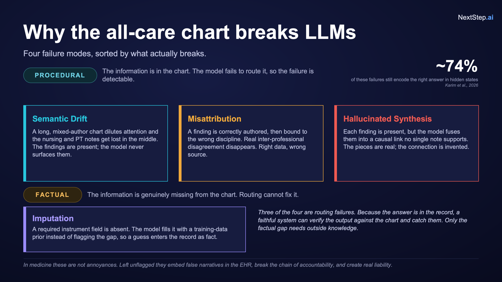
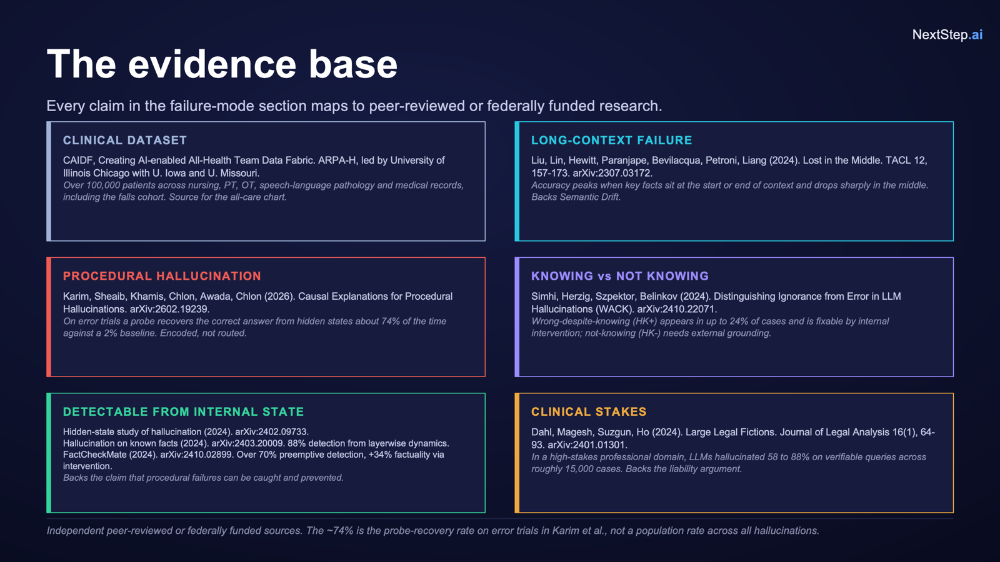

# NextStep.ai — Evidence-First Achievability Gate

> **Source of truth:** [EvidenceFirst_CAIDF.pptx](EvidenceFirst_CAIDF.pptx) (CAIDF Hackathon · May 30, 2026)

A clinical AI gate that decides whether a question *can* be answered **before** it answers.

| Verdict | When | Action |
|---------|------|--------|
| **PROCEED** | Evidence complete in the record | Grounded answer only from chart data |
| **GATHER** | In scope but evidence missing / ambiguous | Name the gap · route to patient, PT, or clinician |
| **ABSTAIN** | Off-distribution or unanswerable | Explain why · hand back to clinician |

**UIC Falls cohort** · **Llama 3.1 8B** + **mxbai-embed-large** · **On-prem** · **NIST 800-171**

---

## Concept (from the deck)



**Problem:** Time-strained providers struggle to navigate the EHR to find, synthesize, and act on data gaps essential for safe multidisciplinary care after a fall.

**Solution:** *Gate the answer* — decide whether to answer, gather, or abstain before generating text.

**Feasibility on one patient** (vague “fall risk” question):

1. Question arrives — not answered directly  
2. Anchor to **Morse**, **Hendrich II**, or **Timed Up and Go**  
3. Check the record — required fields, `author_type`, **30-day window**  
4. Return verdict — score **or** exact missing field, routed  

**Impact:** Safer care · Cleaner reports and claims · One source of truth.



*Auditability: every fact traceable to its discipline before the model speaks (deck).*

---

## Live demo

**https://abasu9.github.io/NextStep.ai/**

If you see the wrong (black coaching) site, follow **[DEPLOY.md](DEPLOY.md)** — remove any **custom domain** under repo **Settings → Pages**.

```bash
./run.sh
# http://localhost:8080
```

- **200 synthetic patients** in [`docs/data/sample_patients.json`](docs/data/sample_patients.json) (not real PHI)  
- Runs **100% in the browser** · no API keys  
- Same **PROCEED / GATHER / ABSTAIN** logic as the deck  

---

## Deck & figures

| Asset | Description |
|-------|-------------|
| [EvidenceFirst_CAIDF.pptx](EvidenceFirst_CAIDF.pptx) | Full hackathon deck (root) |
| [docs/assets/EvidenceFirst_CAIDF.pptx](docs/assets/EvidenceFirst_CAIDF.pptx) | Same deck (served on GitHub Pages) |
| [docs/assets/deck/deck-agentic-loop.png](docs/assets/deck/deck-agentic-loop.png) | Agentic workflow (slide 4) |
| Solution section bars | Verdict distribution (illustrative · deck slide 10) |
| [docs/assets/deck/deck-knowledge-graph.png](docs/assets/deck/deck-knowledge-graph.png) | Knowledge graph (slide 16) |

Regenerate web images from the deck:

```bash
python3 scripts/extract_ppt_assets.py
```

---

## Project layout

| Path | Purpose |
|------|---------|
| `EvidenceFirst_CAIDF.pptx` | Main concept deck |
| `docs/` | Static site (GitHub Pages) |
| `docs/js/engine.js` | Client-side gate + grounded answers |
| `docs/data/sample_patients.json` | 200 synthetic patients |
| `scripts/generate_samples.py` | Cohort generator |
| `scripts/extract_ppt_assets.py` | Pull figures from PPTX |
| `.github/workflows/pages.yml` | Deploy workflow |

---

## Architecture (summary)

- **Concept gate** — embedding distance to calibrated clinical concepts; OOD → ABSTAIN  
- **Answerability check** — escalate when the chart cannot support the question  
- **Fall-risk instrument picker** — Morse / Hendrich II / TUG + per-field GATHER  
- **Grounded answering** — record-only narrative when PROCEED  

Optional Python stack: `app.py`, `server.py`, `logic.py` (local / Ollama; not required for Pages).

---

## Real UIC data

The UIC Falls cohort is **not redistributed**. For a private build, run `build_sample.py` against your mounted dataset and replace `docs/data/sample_patients.json`.
